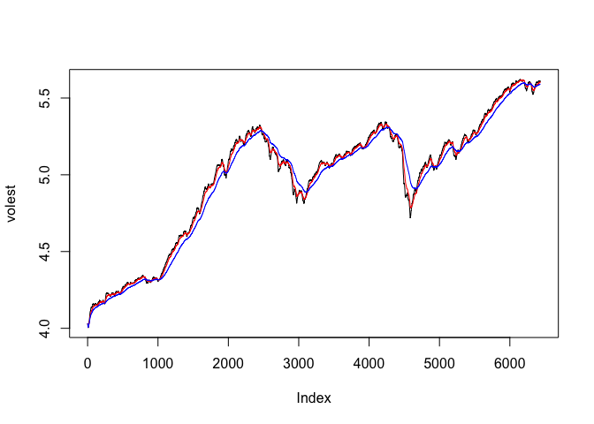
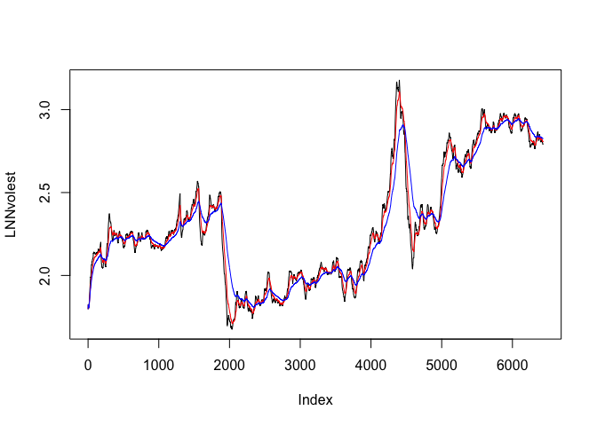

# Doing Data Science: Unit 9.5.3 BLT
Claire Chu  
July 12, 2016  

#R Code and Analysis for Unit 9.5.3

<br>

#### Introduction

Assignment

    Half of you will be assigned to find a series that is less volatile than the S&P 500, the other half a series that is more volatile.
    Download the data.
    Calculate log returns.
    Calculate volatility measure.
    Calculate volatility over entire length of series for various three different decay factors.
    Plot the results, overlaying the volatility curves on the data, just as was done in the S&P example.

Deliverable

    Upload the Markdown file containing your code, analysis, and discussion to GitHub. Post a link to the Markdown file in the space below.
    The markdown document should have code for entering the data, calculating log returns, calculating volatility measure, and calculating volatility for the entire series using three different decay factors.
    Also needs to have code for a plot (and the plot itself) with the data and volatility overlaid.
    The discussion board will talk about the differences in the volatility plots for different stocks.

****************************

###PRELIMINARY STEPS
#####Load the following packages.

```r
setwd("/Users/macnificent/Desktop")
library(tseries)
```

****************************
#I. DOWNLOAD THE FILES

#####Get stock info for S&P500

```r
SNPdata <- get.hist.quote('^gspc',quote="Close")
```

****************************
#II. ANALYSIS

#####Generate Log Return and S&P500 volatility measure

```r
SNPret <- log(log(SNPdata)) - log(SNPdata)
SNPvol <- sd(SNPret) *sqrt(250) * 100
```
#####250 comes from roughly 250 stock trading days in a year
#####Let's generate a volatility measure with a continuous lookback window

```r
vol <- function(d, logrets) {
	var = 0
	lam = 0
	varlist <- c()
	for (r in logrets) {
		lam=lam*(1 - 1/d) + 1
		var = (1 - 1/lam)*var + (1/lam)*r^2
		varlist <- c(varlist, var)
	}
	sqrt(varlist)
}
```
#####NOTE: This is an estimate of volatility, not an estimate of the SNP 500 data itself. High peaks correspond to high flux in SNP data. High peaks correspond to time in stock market when snap 500 data was fluctuating wildly.

#####Let's look at the volatility over the entire length of the series for three different decay factors.

```r
volest <- vol(10,SNPret)
volest2 <- vol(30,SNPret)
volest3 <- vol(100,SNPret)
```
#####Generate a plot to show all the decay factors.

```r
plot(volest,type="l")
lines(volest2,type="l",col="red")
lines(volest3, type = "l", col="blue")
```

<!-- -->
****************************

#III. ANALYSIS OF LINDSAY MANUFACTURING (LNN)

#####Get stock info for LNN

```r
LNNdata <- get.hist.quote('LNN',quote="Close")
```

****************************
#####Generate Log Return and LNN volatility measure

```r
LNNret <- log(log(LNNdata)) - log(LNNdata)
LNNvol <- sd(LNNret) *sqrt(250) * 100
```
#####250 comes from roughly 250 stock trading days in a year
#####Let's generate a volatility measure with a continuous lookback window

```r
vol <- function(d, logrets) {
	var = 0
	lam = 0
	varlist <- c()
	for (r in logrets) {
		lam=lam*(1 - 1/d) + 1
		var = (1 - 1/lam)*var + (1/lam)*r^2
		varlist <- c(varlist, var)
	}
	sqrt(varlist)
}
```

#####Let's look at the volatility over the entire length of the series for three different decay factors.

```r
LNNvolest <- vol(10,LNNret)
LNNvolest2 <- vol(30,LNNret)
LNNvolest3 <- vol(100,LNNret)
```
#####Generate a plot to show all the decay factors.

```r
plot(LNNvolest,type="l")
lines(LNNvolest2,type="l",col="red")
lines(LNNvolest3, type = "l", col="blue")
```

<!-- -->
