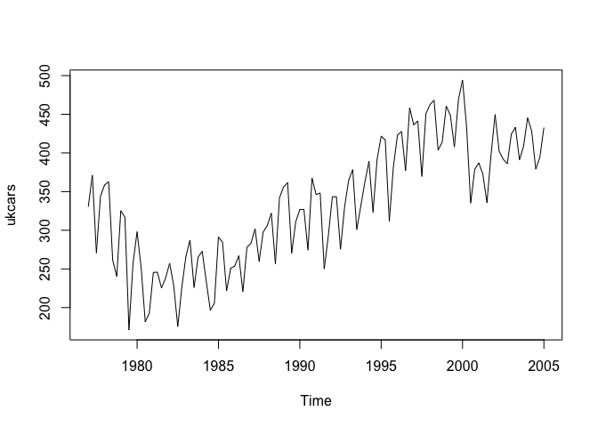
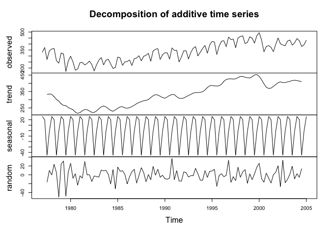
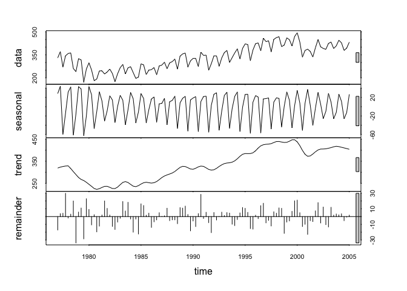
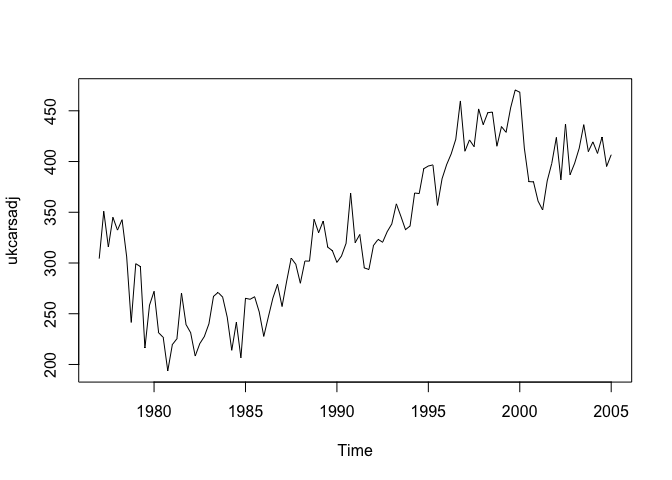
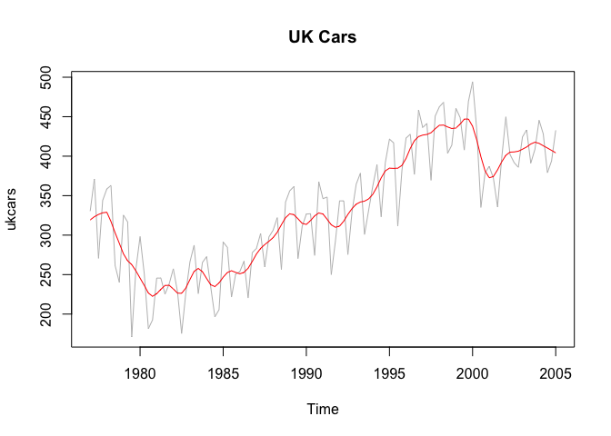
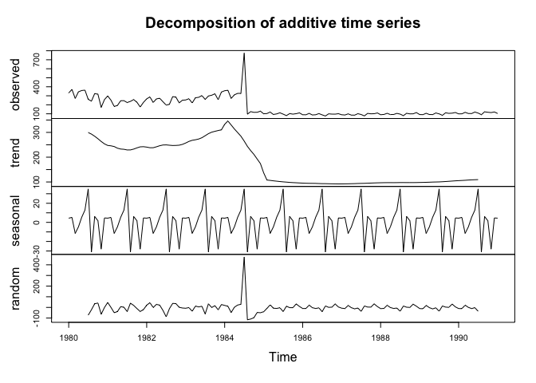
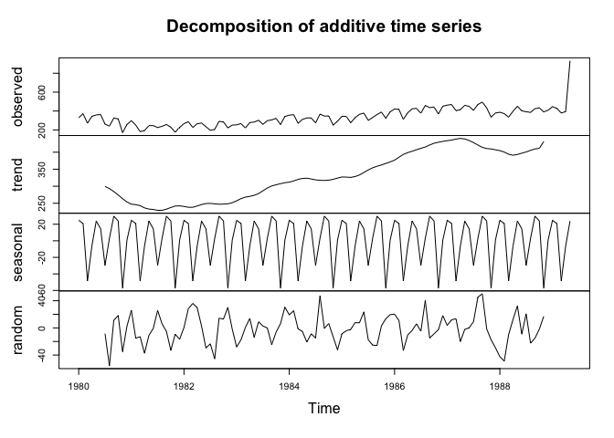
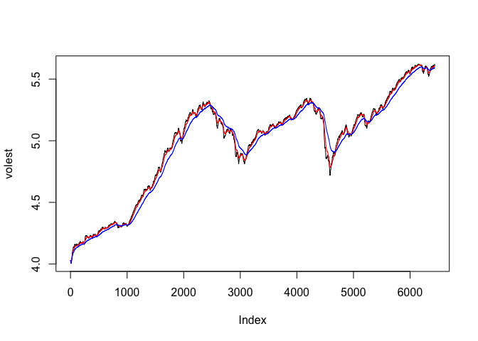
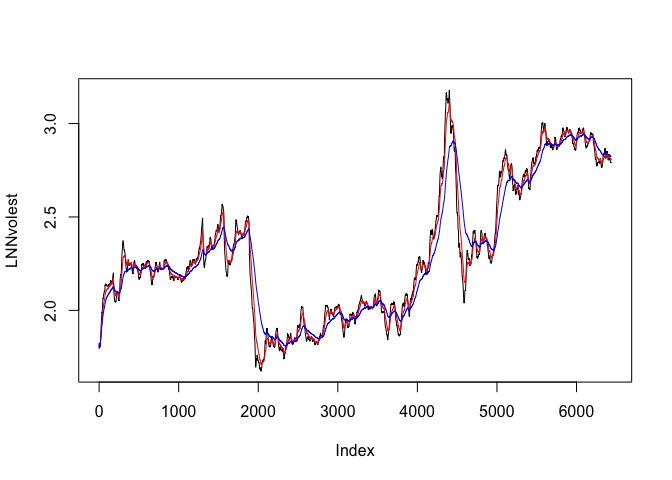

# Doing Data Science: Unit 9 Homework
Claire Chu  
July 19, 2016  

#R Code and Analysis for Unit 9 Homework

<br>

#### Introduction

Assignment

1)	[Go through the electric equipment example.](#id-section1)

More examples of forecasting!
Code to load data:
library(fpp) #fpp package must be installed first
data(ukcars)
•	Plot the time series. Can you identify seasonal fluctuations and/or a trend? 
•	Use a classical decomposition to calculate the trend-cycle and seasonal indices. 
•	Do the results support the graphical interpretation from part (a)? 
•	Compute and plot the seasonally adjusted data. 
•	Change one observation to be an outlier (e.g., add 500 to one observation), and recompute the seasonally adjusted data. What is the effect of the outlier? 
•	Does it make any difference if the outlier is near the end rather than in the middle of the time series? 
•	Use STL to decompose the series. 

2)	[I’ll assign a stock for each student.](#id-section2.0)

•	First go through the r code which used for S&P500.
Then do the following for the assigned stock.
•	Download the data.
•	Calculate log returns.
•	Calculate volatility measure.
•	Calculate volatility measure with a continuous lookback window.
      Plot the results with a volatility curve overlay.


****************************
<div id='id-section1'/>
#QUESTION 1
###PRELIMINARY STEPS
######Load the following libraries and packages.

```r
setwd("/Users/macnificent/Desktop")
library(fpp)
```

#####load data

```r
data(ukcars)
```

****************************
#####looking at the initial plot, it appears to be trending seasonally, cyclically, and in a sinosoudal pattern.

```r
plot(ukcars)
```

<!-- -->

#####classical decomposition on the data

```r
fitd <- decompose(ukcars)
plot(fitd)
```

<!-- -->
#####this seems to be consistent with our observations from part a.

****************************
#####generate a line of fit

```r
fit <- stl(ukcars, s.window=5)
plot(fit)
```

<!-- -->

#####compute the seasonally adjusted data

```r
ukcarsadj <- seasadj(fitd)
plot(ukcarsadj)
```

<!-- -->

#####plot uk cars vs time

```r
plot(ukcars, col="gray", main="UK Cars")
lines(fit$time.series[,2],col="red",ylab="Trend")
```

<!-- -->

****************************
###compute how many entries are in the dataset so we can insert an outlier

```r
str(ukcars)
```

```
##  Time-Series [1:113] from 1977 to 2005: 330 371 271 344 358 ...
```

###insert an outlier in the middle of the dataset (at the 55th entry)

```r
ukcars2 <- ts(c(ukcars[1:54],ukcars[55]+500,elecequip[56:133]), start=c(1980,1), frequency=12)
fitd2 <- decompose(ukcars2)
plot(fitd2)
```

<!-- -->

#####insert an outlier at the end of the dataset (at the 113th entry)

```r
ukcars3 <- ts(c(ukcars[1:112],ukcars[113]+500), start=c(1980,1), frequency=12)
fitd3 <- decompose(ukcars3)
plot(fitd3)
```

<!-- -->
****************************
#####CONCLUSION: We can see that the data is not resistant to outliers. the model breaks down with any extreme values. we can see that the outlier in the middle of the data makes it look like there was a large decline in the data. The outlier at the end looks extreme, but for the most part the rest of the model appears to be the same.

****************************
<div id='id-section2.0'/>
#QUESTION 2
###PRELIMINARY STEPS
#####Load the following packages.

```r
setwd("/Users/macnificent/Desktop")
library(tseries)
```

****************************
#I. DOWNLOAD THE FILES

#####Get stock info for S&P500

```r
SNPdata <- get.hist.quote('^gspc',quote="Close")
```

****************************
#II. ANALYSIS

#####Generate Log Return and S&P500 volatility measure

```r
SNPret <- log(log(SNPdata)) - log(SNPdata)
SNPvol <- sd(SNPret) *sqrt(250) * 100
```
#####250 comes from roughly 250 stock trading days in a year
#####Let's generate a volatility measure with a continuous lookback window

```r
vol <- function(d, logrets) {
	var = 0
	lam = 0
	varlist <- c()
	for (r in logrets) {
		lam=lam*(1 - 1/d) + 1
		var = (1 - 1/lam)*var + (1/lam)*r^2
		varlist <- c(varlist, var)
	}
	sqrt(varlist)
}
```
#####NOTE: This is an estimate of volatility, not an estimate of the SNP 500 data itself. High peaks correspond to high flux in SNP data. High peaks correspond to time in stock market when snap 500 data was fluctuating wildly.

#####Let's look at the volatility over the entire length of the series for three different decay factors.

```r
volest <- vol(10,SNPret)
volest2 <- vol(30,SNPret)
volest3 <- vol(100,SNPret)
```
#####Generate a plot to show all the decay factors.

```r
plot(volest,type="l")
lines(volest2,type="l",col="red")
lines(volest3, type = "l", col="blue")
```

<!-- -->
****************************

#III. ANALYSIS OF LINDSAY MANUFACTURING (LNN)

#####Get stock info for LNN

```r
LNNdata <- get.hist.quote('LNN',quote="Close")
```

****************************
#####Generate Log Return and LNN volatility measure

```r
LNNret <- log(log(LNNdata)) - log(LNNdata)
LNNvol <- sd(LNNret) *sqrt(250) * 100
```
#####250 comes from roughly 250 stock trading days in a year
#####Let's generate a volatility measure with a continuous lookback window

```r
vol <- function(d, logrets) {
	var = 0
	lam = 0
	varlist <- c()
	for (r in logrets) {
		lam=lam*(1 - 1/d) + 1
		var = (1 - 1/lam)*var + (1/lam)*r^2
		varlist <- c(varlist, var)
	}
	sqrt(varlist)
}
```

#####Let's look at the volatility over the entire length of the series for three different decay factors.

```r
LNNvolest <- vol(10,LNNret)
LNNvolest2 <- vol(30,LNNret)
LNNvolest3 <- vol(100,LNNret)
```
#####Generate a plot to show all the decay factors.

```r
plot(LNNvolest,type="l")
lines(LNNvolest2,type="l",col="red")
lines(LNNvolest3, type = "l", col="blue")
```

<!-- -->
****************************
#####CONCLUSION: We can see that Lindsay Manufacturing was much more volatile than the S&P500, but that there were a few trends that are similar between the two. For example, we can see that at the beginning of the graph, both are trending upwards until 1500 and at the end of the graph, both are also trending upwards starting at about 4500. 
